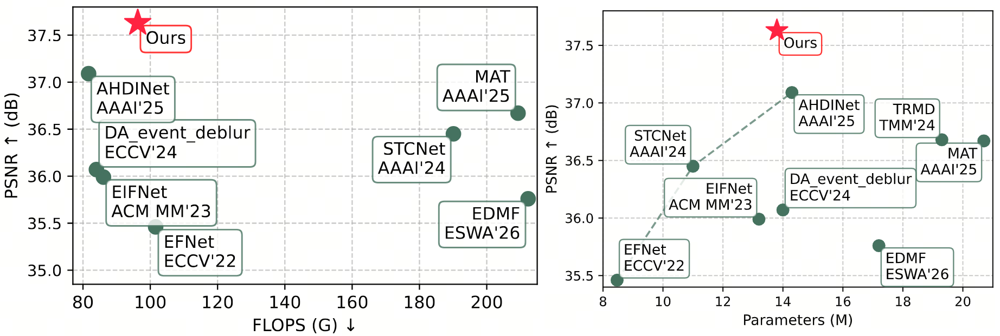

# [ICME'26] Revisiting Event Guided Deblurring with State Space Model

[News] You may also want to check our related works:

- **Event Deblur Pro (2026.03)** [Code](https://github.com/NikonD850/NTIRE26_event_deblur) 🏆 3rd Place of [2nd Event-based Image Deblurring Challenge (NTIRE@CVPR'26)](https://www.codabench.org/competitions/12918)
- **TRM-UNet (2026.01)** [Code](https://github.com/NikonD850/TRM-UNet) ICASSP'26 (CCF-B)

TL;DR: New state-of-the-art performance on the GoPro dataset.



## Installation
```
git clone https://github.com/NikonD850/REDGSSM.git
cd REDGSSM

conda create -n REDGSSM python=3.10 -y
conda activate REDGSSM
pip install torch==2.5.1+cu124 torchvision==0.20.1+cu124 --index-url https://download.pytorch.org/whl/cu124

git clone https://github.com/state-spaces/mamba.git
cd mamba
git checkout 8ffd905
python -m pip install . --no-build-isolation
cd ..

python -m pip install matplotlib scikit-image opencv-python yacs joblib natsort h5py tqdm timm thop
```

## Training and Evaluation
The model is trained with 4 NVIDIA RTX 4090D.

The time for 1 epoch (1000 iterations) is within 75 minutes, including both training and validating.

For **TRAINING SPEED UP**, please follow our [new repository](https://github.com/NikonD850/NTIRE26_event_deblur).

### Train
- Download the [GoPro events train/test dataset](https://pan.baidu.com/s/1UKV-sPGo9mRf7XJjZDoF7Q) (code: kmaz) to your data root (provided by AHDINet's authors)
- Change both training.yml and config.py to your settings.
- Train the model with default arguments by running

```
 nohup python main_train.py > REDGSSM-train.log 2>&1 &
```
### Evaluation
- Download the [GoPro events test dataset](https://pan.baidu.com/s/1UKV-sPGo9mRf7XJjZDoF7Q) (code: kmaz) to your data root (provided by AHDINet's authors)
- Download the [pretrained model](https://drive.google.com/file/d/1rHNilWTiOqcqTCycxVCs3rwVBqAKWV7u/view?usp=sharing) to REGDSSM/models/REGDSSM/model_best.pth
- Change both testing.yml and config.py to your settings.
- Test the model with default arguments by running

```
  python main_test.py
```
## Acknowledgement
Thanks to the inspirations and codes from [AHDINet](https://github.com/wyang-vis/AHDINet) and [EVSSM](https://github.com/kkkls/EVSSM/)

## Cite this work (BibTeX)
```
@INPROCEEDINGS{fan2026revisiting,
  author={Fan, Dawei and Ji, Fan and Tang, Xiongxin and Chu, Xiaofeng and Chen, Qiao and Yang, Hanxiang and Lin, Yijun and Xu, Fanjiang},
  booktitle={2026 IEEE International Conference on Multimedia and Expo (ICME)}, 
  title={Revisiting Event Guided Deblurring with State Space Model}, 
  year={2026},
  volume={},
  number={},
  pages={1-6},
  }
```
